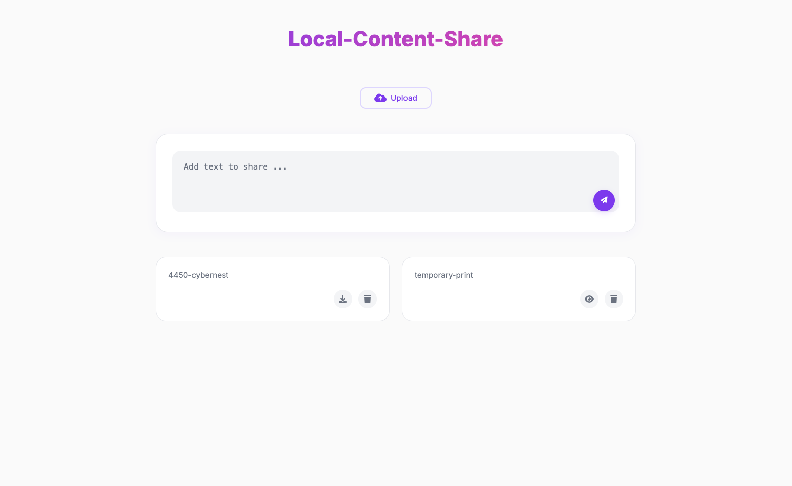
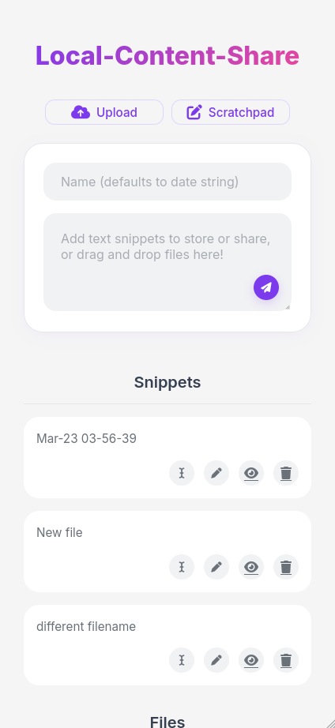
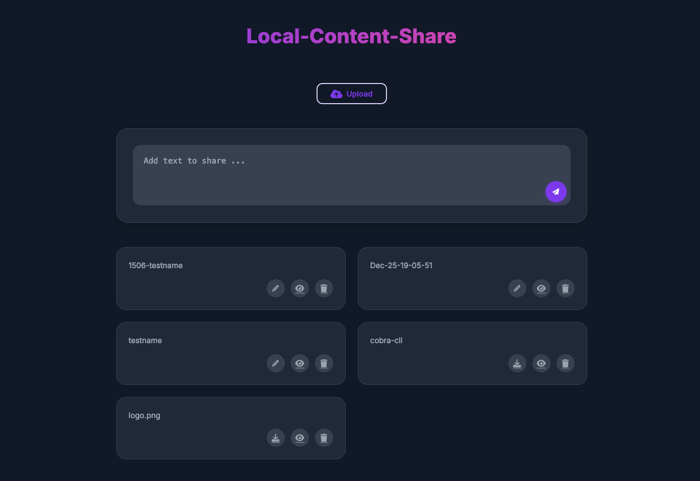
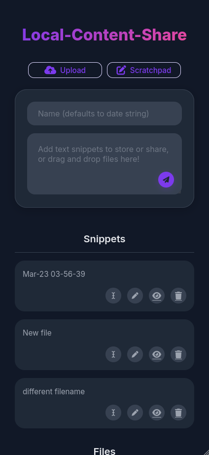

<div align="center">
  
  <h1>Local Content Share</h1>

  <a href="https://github.com/tanq16/local-content-share/actions/workflows/binary-build.yml"></a>&nbsp;<a href="https://github.com/tanq16/local-content-share/actions/workflows/docker-publish.yml"></a><br>
  <a href="https://github.com/Tanq16/local-content-share/releases"></a>&nbsp;<a href="https://hub.docker.com/r/tanq16/local-content-share"></a><br><br>
  <a href="#screenshots">Screenshots</a> &bull; <a href="#installation-and-usage">Install & Use</a> &bull; <a href="#tips-and-notes">Tips & Notes</a>
</div>

---

A simple web application for sharing text snippets and files within your local network across any device. The app is launched via an executable or as a container. The primary features are:

- Make plain text snippets available to view/share on any device in the local network
- Upload files and make them available to view/download on any device in the local network
- Access content through a clean, modern interface with dark mode support that looks good on mobile too
- Pure HTTP API, i.e., *no use of websockets* - this is a good thing as it means *no external communications needed*
- Available as a PWA (so it shows as an icon in mobile home screens)
- Rename snippets of files uploaded to easily find them in the UI
- Available as a binary for MacOS, Windows, and Linux for both x86-64 and ARM64 architectures
- Multi-arch (x86-64 and ARM64) Docker image that works well with reverse proxies

> [!NOTE]
> This application is meant to be deployed within your homelab only. There is no authentication mechanism implemented.

## Screenshots

| | Desktop View | Mobile View |
| --- | --- | --- |
| Light |  |  |
| Dark |  |  |

## Installation and Usage

### Using Binary

1. Download the appropriate binary for your system from the [latest release](https://github.com/tanq16/local-content-share/releases/latest)
2. Make the binary executable (Linux/macOS) with `chmod +x local-content-share-*`
3. Run the binary with `./local-content-share-*`

The application will be available at `http://localhost:8080`

### Using Docker

Use `docker` CLI one liner and setup a persistence directory (so a container failure does not delete your data):

```bash
mkdir $HOME/.localcontentshare
```
```bash
docker run --name local-content-share \
  -p 8080:8080 \
  -v $HOME/.localcontentshare:/app/data \
  tanq16/local-content-share:main
```

The application will be available at `http://localhost:8080`

You can also use the following compose file with container managers like Portainer and Dockge (remember to change the mounted volume):

```yaml
services:
  contentshare:
    image: tanq16/local-content-share:main
    container_name: local-content-share
    volumes:
      - /home/tanq/lcshare:/app/data
    ports:
      - 8080:8080
```

### Using Go

With `Go 1.23+` installed, run the following to download the binary to your GOBIN:

```bash
go install github.com/tanq16/local-content-share@latest
```

Or, you can build from source like so:

```bash
git clone https://github.com/tanq16/local-content-share.git
cd local-content-share
go build .
./local-content-share # to run the tool
```

## Tips and Notes

- To share text content:
   - Type or paste your text in the text area
   - Click the send button (like the telegram arrow)
   - It will set a timestamp-based file name
- To rename files or text snippets:
   - Click the pencil icon and provide the new name
   - It will automatically append 4 random digits if your input isn't unique
- To share files:
   - Click the upload button and select your file
   - OR drag and drop your file to the text area
   - It will automatically append 4 random digits if filename isn't unique
- To view content, click the eye icon:
   - Text content: shows raw text
   - Files: shows raw text, images, PDFs, etc. (basically files that browsers can view)
- To download files, click the download icon
- To delete content, click the trash icon

A quick note of the data structure:

The application creates a `data` directory to store all uploaded files and text content (both in `files` and `text` subfolders respectively). Make sure the application has write permissions for the directory where it runs.
